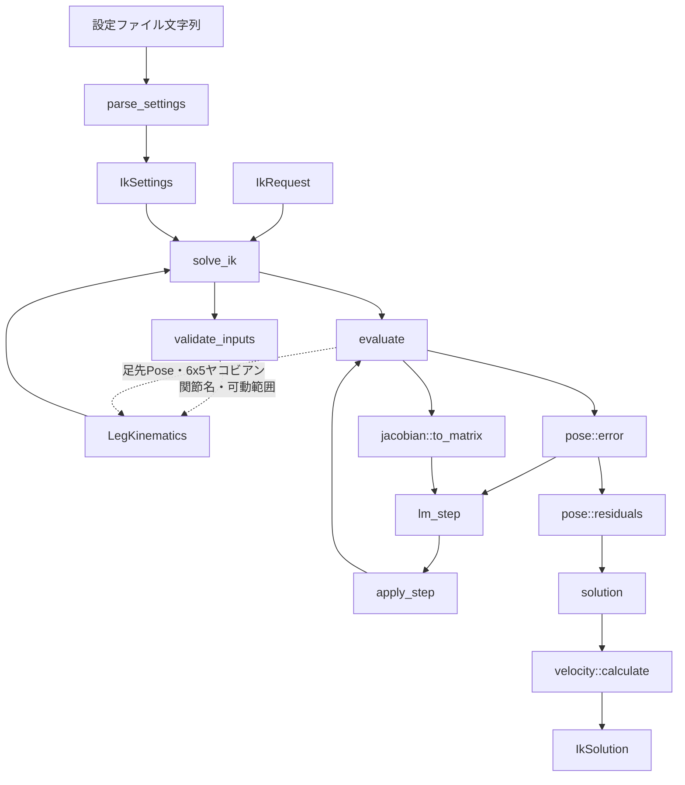

# inverse_kinematics

Cassieの片脚5能動関節を対象とする、杉原Levenberg-Marquardt法の数値IKクレートです。
目標はワールド座標系の足先6次元Poseで、5自由度で完全に到達できない場合も重み付き残差を
最小化した有限な近似解と終了状態を返します。

## 境界

- 距離は[m]、角度は[rad]です。
- Pose姿勢は`[roll, pitch, yaw]`で、右手系の`Rz(yaw) * Ry(pitch) * Rx(roll)`です。
- IKの基準は腰Poseです。
- `LegKinematics`は、関節名、可動範囲、候補角における足先Poseと6x5ヤコビアンを返します。
- Cassieの受動関節と閉リンク拘束は、Issue #8側が解いた有効運動学として渡します。
- このクレートはCassieを単純な5関節直列リンクとして近似しません。

Issue #8が未実装のため、現時点のテストでは同じ公開契約を満たす運動学スタブを使用します。
実Cassieへの接続完了には、Issue #8から閉リンク拘束整合済みの`LegKinematics`実装が必要です。

`LegKinematics::evaluate`が返すヤコビアンは、並進・回転ともworld frameで表します。回転3行は
RPY角の時間微分ではなくworld frameの角速度であり、`pose::error`が作る相対回転ベクトルと同じ
座標系でなければなりません。足先Poseの評価点とframeは、重心軌道側の目標Poseと一致するよう
Issue #8で決定し、モデルアダプタの契約として記録する必要があります。

## 関数の関係



`solve_ik`は収束、更新量下限、最大反復のいずれかで`solution`へ進みます。入力不正、モデル
評価失敗、非有限値、行列分解失敗は`IkError`として返し、未収束の有限な近似解は
`IkStatus`と残差を含む`IkSolution`として返します。

## 設定

既定の調整値は`config/ik.conf`にあります。ファイルI/OはDoraノードなど最上位の境界で行い、
純粋な`parse_settings`へ文字列を渡します。

```rust
let source = std::fs::read_to_string("inverse_kinematics/config/ik.conf")?;
let settings = inverse_kinematics::parse_settings(&source)?;
```

未知キー、重複、欠落、非有限値、非正値は拒否されます。

## 検証

```bash
cargo test -p inverse_kinematics
cargo clippy -p inverse_kinematics --all-targets -- -D warnings
```
